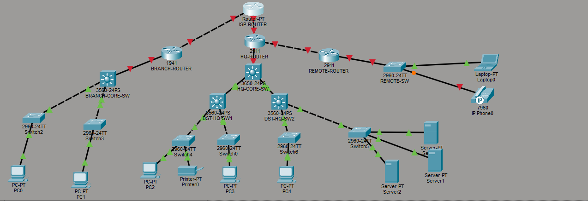
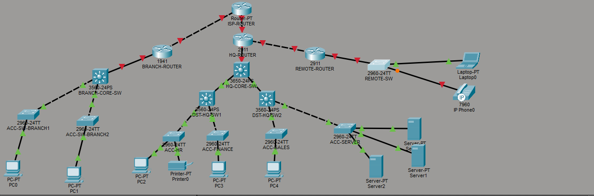

# Network-topology-for-Beta-company
This is a three tier architecture,goal to make it redudant

I have created a network topology for beta enterprise,it has five departments , finance, HR, sales and IT,it works remotely.
I have  three routers from the isp router, branch router ,remote router and the head-quater router
It is the first day i have configured the routers for branch,hq and remote, i have set the hostname using the 'hostname' password 'enable secret ''' for router CLI access,also set password to access the routers via console using 'line console 0' ,'password ''','login','exit' . to make all the password not to be showd in plain text i have run 'service password-encyption',
I have enable ssh using commands 'ip  domain-name beta.local' 'username '' password ''' then 'crypto key generate rsa' then locking the VTY lines to use ssh, then prompt to enter modulus size this turn on ssh.Then 'line vty 0 4' meaning it has a maximum of 4 ssh access at the same time,'transport input ssh' to enable ssh only, 'login local' to check pair username/password instead of shared line password.
i have done this to all routers except the isp which i encrypted the cli access only.
Then i has set banner message of the day 'banner motd 'for info about prohibited access. i have made sure to run 'copy running-config startup-config' to mantain the configs even after router shut-down.
Here is the topology. 

Today i have done switch hardening;setting up password for console,ssh and setting banner display,i have used same commands used to harden router except i added 'no ip domain-lookup' to exempt it from doing dns .I also named the remaining need to be named devices.

Today i have created vlan 10,mamangement, vlan 20, staff vlan 30, sales vlan 40 server and change the native vlan to 99 from 1 for security purposes. i have assigned all the vlans on the core switch, then on dst-sw1 i have assigned vlan 20,30,99 for redudancy.Then dst-sw2 assigned 10,40,99 ,i have improved than on the last projevt where i assigned all vlans to each switch.
Acc-sw1 has vlan 20,99. Acc-sw2 has vlan 30,99. Acc-sw3 has vlan 10,99. Acc-sw4 has vlan 40,99 ,Acc-sw5 has vlan 20,99,Acc-sw6 has vlan 30,99.Remote-sw has vlan 10,99.
I have set vlan trunking on both ends of the switches,with the native vlan as 99 except for the remote switch which i have set mode to access since it serves one vlan 10.
